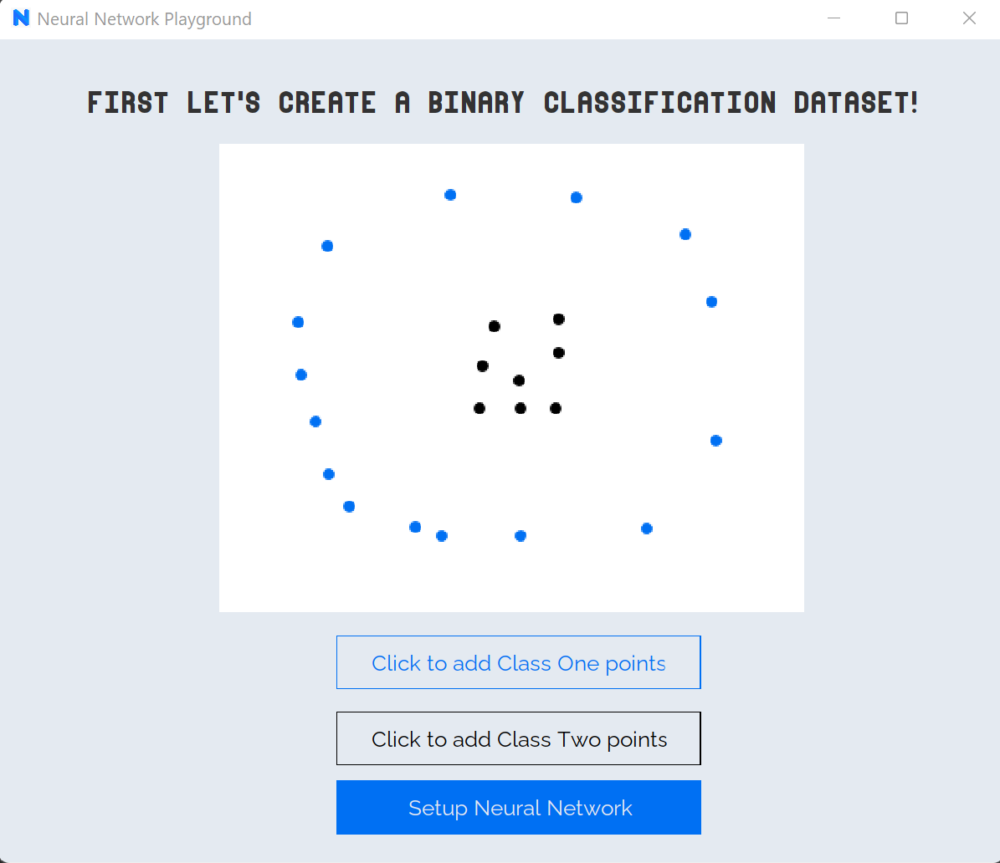
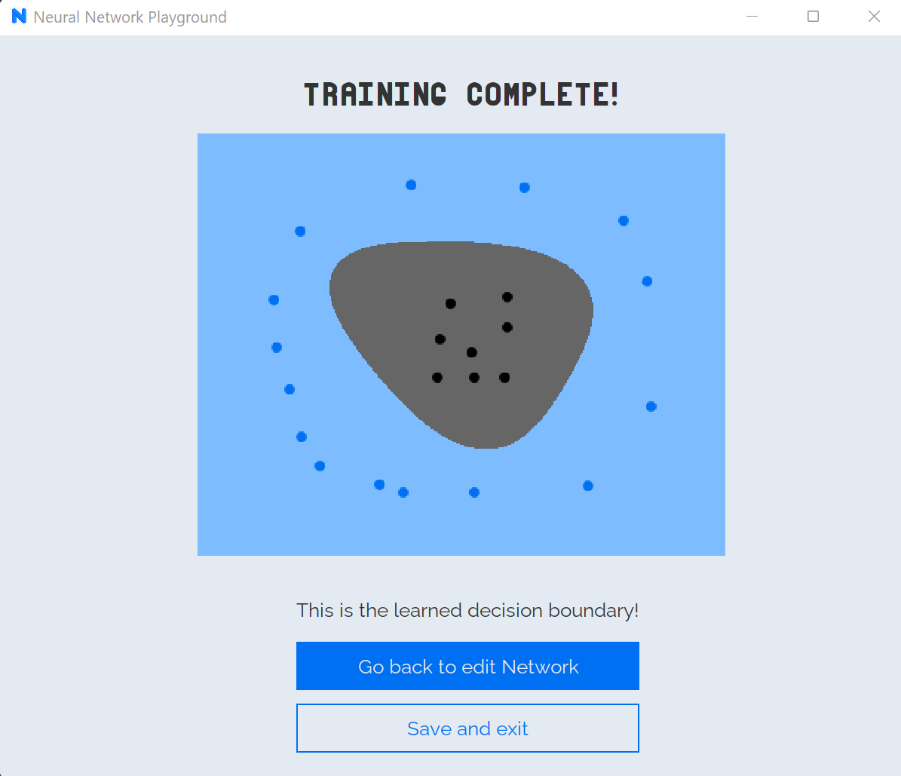
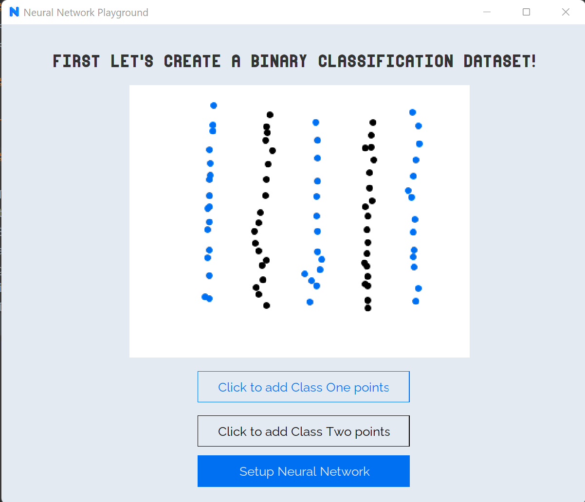
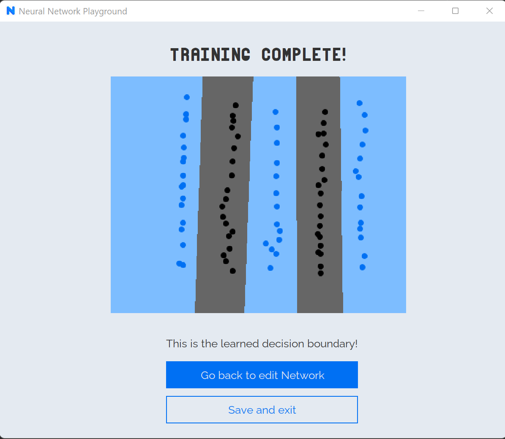
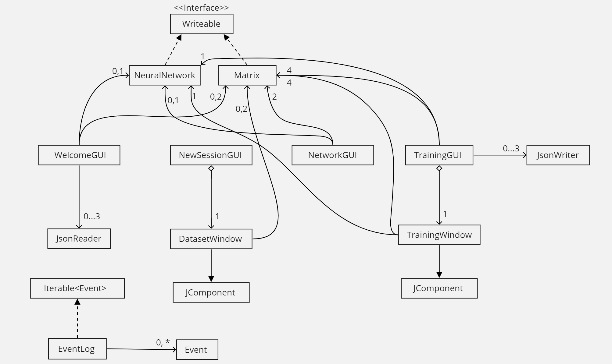

# Neural Network Playground

### Get your hands dirty with Machine Learning! We will train models and visualize Machine Learning right here in Java!

---

 Hyperparameters |        Training data entered by user         |  Learned decision boundary
:--------:|:--------------------------------------------:|:-------------------------:
 4 Hidden Neurons   100,000 Iterations   0.1 Learning rate |                |   
200 Hidden Neurons   1,000,000 Iterations   0.1 Learning rate|                |

## Motivation

The way Machine learning is used to solve problems such as image recognition which are difficult to approach using
traditional algorithmic approaches has always fascinated me. 
Being a strong believer of the fact that the best way to learn something is to build it yourself, I decided to code
a Neural Network in Java. The demo below is 'Tensorflow Playground' (https://playground.tensorflow.org/), a project by 
google which lets you play with Neural Networks in the browser. You can choose the number of layers, number of neurons,
iterations etc, and then watch the Neural Network improve its decision boundary as it learns. 
I want to build something very similar in Java with some additional capabilities such as letting the user make their 
own dataset.

---

## What is Neural Network Playground
Neural Network Playground is my interpretation of Google's Tensorflow Playground in Java with features that make
it much more exciting in my opinion. When I was playing with Google's implementation, I really wished I could
add my own dataset by inserting points by clicking with my mouse for different classes and test the neural network on those.
I also wished I could download the learned weights and re-import them to quickly see the decision boundary instead of retraining.
These wishes directly inspired my User stories.

I want to include both these features in my implementation. Currently, since the program runs only in the console, the 
user has to manually enter data points, and simply must test points. Without a GUI a decision boundary can't be drawn.
But soon I wish to have all these elements completed.

---

## Purpose

Building a neural network and matrix multiplication operations from scratch allows me to truly understand the underlying
concepts in machine learning, and building tests for each of them also gives more practice for CPSC 210. Since there are
a lot more powerful machine learning libraries, the target audience isn't the one who would use this as a machine 
learning library.

The target audience is people like me who want to strengthen their intuition being how different model hyperparameters 
affect learning in Neural Networks. Also there is something extremely satisfying, watching a model learn a good decision
boundary. I hope to be able to put out such a visualization in the GUI stage of this project.

---
## User Guide:

- Start by clicking on create a new session
- You are now greeted by a screen to help you create a dataset
- Click on the button "Add Class one points" and now click with your mouse on the white frame
- You will see this adds points on the inner white artboard
- Once satisfied, click the button "Add class two points" and click with your mouse on the white frame
- Once satisfied with points in both classes, click the "Setup Neural Network" button
- This will take you to a new window where you can enter parameters of the Network
- For simplicity, enter 4 for Number of Hidden neurons, 100000 for Number of Iterations and 
enter 0.1 for learning rate
- Click the button "Train Neural Network"
- After a brief pause you should be greeted with a new window displaying the decision
boundary learnt by the Neural Network
- Click save and exit to save JSON or Edit network to change neural network parameters
- This time try entering 1 for Number of hidden neurons, keeping the rest the same and 
click on Train
- You will notice the model only learns a linear decision boundary this time around
- Save and exit the application, reopen and click load, you will see the saved decision boundary

## UML Diagram

Reflection:

I felt that my GUI classes have a lot of duplication, as all of them implement showElements(), placeElements(),
setFonts() and similar functions. To improve the code, I would make an abstract class GUI, and then make all of my 
other GUI based classes extend it.

Moreover, I also would like to ensure that the decision boundary is visible as we train, that way we can visualize the
model learning. This could be down by adding a background Thread, which I am not familiar
with but would love to learn more about.

In my UMl diagram I have included the extend relation to JComponent, since DatasetWindow and
TrainingWindow are classes I created and I felt that the fact that they are not GUI but JComponent windows should be
included in a high level UML view.

## References

- Tensorflow Playground, https://playground.tensorflow.org/  
Note: While the visualization inspired me, I am not using any of the code as reference

- The coding train youtube channel: https://www.youtube.com/watch?v=XJ7HLz9VYz0&list=PLRqwX-V7Uu6Y7MdSCaIfsxc561QI0U0Tb
  This playlist builds a neural network library in javascript. I got the idea of making a separate Matrix class from
here. While my Neural network training, backpropagation and testing code is completely distinct, this was an extremely
helpful reference to figure out the math.
- https://www.youtube.com/watch?v=OOb1eil4PCo
- https://www.youtube.com/watch?v=iE8tZ0hn2Ws
- https://www.youtube.com/watch?v=5o3fMLPY7qY
- https://www.youtube.com/watch?v=sq46PYdW4c8

